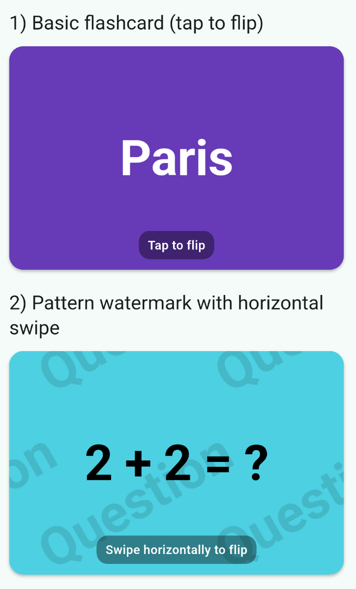

# flashcard

A lightweight, accessible Flutter widget for question/answer flashcards with:

* Flip by **tap** or **swipe** (horizontal/vertical)
* **Automatic text contrast** (WCAG-based) against any background color
* **Tiled diagonal watermark** via `CustomPainter`
* Built-in **text auto-fit** (no external dependency)
* Minimal API, null-safety, and `flutter_lints`-clean

[](https://pub.dev/packages/colored_flashcard)
[](https://pub.dev/packages/colored_flashcard/score)
[](https://pub.dev/packages/colored_flashcard/score)

> GIFs/Screenshots: Add your media under `assets/` and link them here.
> Example command to record a quick demo on desktop: `flutter run -d macos` and capture with your OS tool.

---

## Features

* **Flip behaviors**: `none`, `tap`, `verticalSwipe`, `horizontalSwipe`
* **Background styles**: `solid`, `pattern` (tiled diagonal watermark)
* **Auto-fit text**: Binary search based sizing to avoid overflow
* **Contrast-aware text**: Picks black/white for optimal readability
* **Accessible**: Semantics for screen readers and hints

---

## Quick Start

```dart
import 'package:flutter/material.dart';
import 'package:flashcard/flashcard.dart';

class MyCard extends StatelessWidget {
  const MyCard({super.key});

  @override
  Widget build(BuildContext context) {
    return AspectRatio(
      aspectRatio: 3 / 2,
      child: Flashcard(
        questionText: 'What is the capital of France?',
        answerText: 'Paris',
        frontColor: Colors.amber,
        backColor: Colors.teal,
        flipBehavior: FlashcardFlipBehavior.tap,
        backgroundStyle: FlashcardBackgroundStyle.pattern,
        watermarkTextFront: 'Question',
        watermarkTextBack: 'Answer',
        autoFitText: true,
        minFontSize: 16,
        maxLines: 10,
        borderRadius: 16,
        elevation: 2,
        padding: const EdgeInsets.symmetric(horizontal: 16),
      ),
    );
  }
}
```

```dart
// Fullscreen example
class FullscreenCard extends StatelessWidget {
  const FullscreenCard({super.key});

  @override
  Widget build(BuildContext context) {
    return SizedBox.expand(
      child: Flashcard(
        questionText: 'What is the capital of France?',
        answerText: 'Paris',
        frontColor: Colors.amber,
        backColor: Colors.teal,
        flipBehavior: FlashcardFlipBehavior.tap,
        backgroundStyle: FlashcardBackgroundStyle.pattern,
        watermarkTextFront: 'Question',
        watermarkTextBack: 'Answer',
        autoFitText: true,
        minFontSize: 16,
        maxLines: 10,
        borderRadius: 16,
        elevation: 2,
        padding: const EdgeInsets.symmetric(horizontal: 16),
      ),
    );
  }
}
```

### Example app

Run the included demo:

```bash
cd example && flutter run -d chrome
```

---

## API

```dart
Flashcard({
  required String questionText,
  required String answerText,
  required Color frontColor,
  Color? backColor,
  FlashcardFlipBehavior flipBehavior = FlashcardFlipBehavior.tap,
  FlashcardBackgroundStyle backgroundStyle = FlashcardBackgroundStyle.solid,
  String? watermarkTextFront,
  String? watermarkTextBack,
  bool autoForegroundColor = true,
  TextStyle? questionTextStyle,
  TextStyle? answerTextStyle,
  bool autoFitText = true,
  double minFontSize = 16,
  int maxLines = 10,
  double borderRadius = 16,
  double elevation = 2,
  EdgeInsetsGeometry padding = const EdgeInsets.symmetric(horizontal: 16),
})
```

### Enums

```dart
enum FlashcardFlipBehavior { none, tap, verticalSwipe, horizontalSwipe }
enum FlashcardBackgroundStyle { solid, pattern }
```

---

## Property Table

| Prop                  | Type                       | Default                                 | Description                                                                |
| --------------------- | -------------------------- | --------------------------------------- | -------------------------------------------------------------------------- |
| `questionText`        | `String`                   | —                                       | Text shown on the front side.                                              |
| `answerText`          | `String`                   | —                                       | Text shown on the back side.                                               |
| `frontColor`          | `Color`                    | —                                       | Background color for the front side.                                       |
| `backColor`           | `Color?`                   | derived from `frontColor`               | Background for the back side (slightly adjusted from front if null).       |
| `flipBehavior`        | `FlashcardFlipBehavior`    | `FlashcardFlipBehavior.tap`             | Interaction to flip the card.                                              |
| `backgroundStyle`     | `FlashcardBackgroundStyle` | `FlashcardBackgroundStyle.solid`        | Solid or patterned (tiled watermark).                                      |
| `watermarkTextFront`  | `String?`                  | `null`                                  | Optional diagonal watermark on the front side.                             |
| `watermarkTextBack`   | `String?`                  | `null`                                  | Optional diagonal watermark on the back side.                              |
| `autoForegroundColor` | `bool`                     | `true`                                  | Choose black/white text automatically based on background contrast.        |
| `questionTextStyle`   | `TextStyle?`               | `displayLarge` bold with computed color | Style for question text. Color may be overridden if `autoForegroundColor`. |
| `answerTextStyle`     | `TextStyle?`               | `displayLarge` bold with computed color | Style for answer text. Color may be overridden if `autoForegroundColor`.   |
| `autoFitText`         | `bool`                     | `true`                                  | Enable built-in text auto-fit.                                             |
| `minFontSize`         | `double`                   | `16`                                    | Minimum font size when auto-fitting.                                       |
| `maxLines`            | `int`                      | `10`                                    | Maximum number of text lines.                                              |
| `borderRadius`        | `double`                   | `16`                                    | Card border radius.                                                        |
| `elevation`           | `double`                   | `2`                                     | Material elevation.                                                        |
| `padding`             | `EdgeInsetsGeometry`       | `EdgeInsets.symmetric(horizontal: 16)`  | Inner padding around text.                                                 |

---

## Accessibility

* The root widget exposes semantics as a **button** when interactive.
* Semantic **labels** describe whether the **question** or **answer** is currently visible.
* Semantic **hints** indicate the interaction (`tap` or `swipe`) when enabled.
* Ensure sufficient color contrast. The widget automatically picks black/white foreground using WCAG contrast against your background colors.

---


## Screenshots / GIFs




---

## Testing

Run unit/widget tests:

```bash
flutter test
```

---

## License

[MIT](LICENSE)

---
